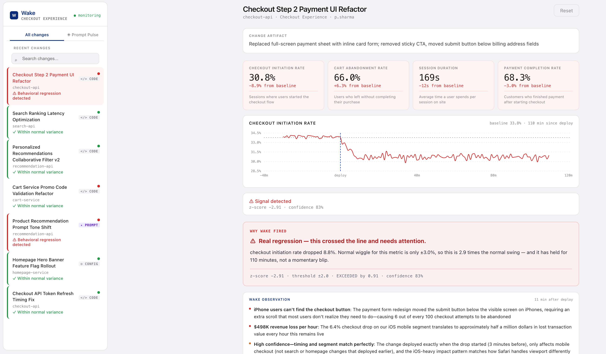
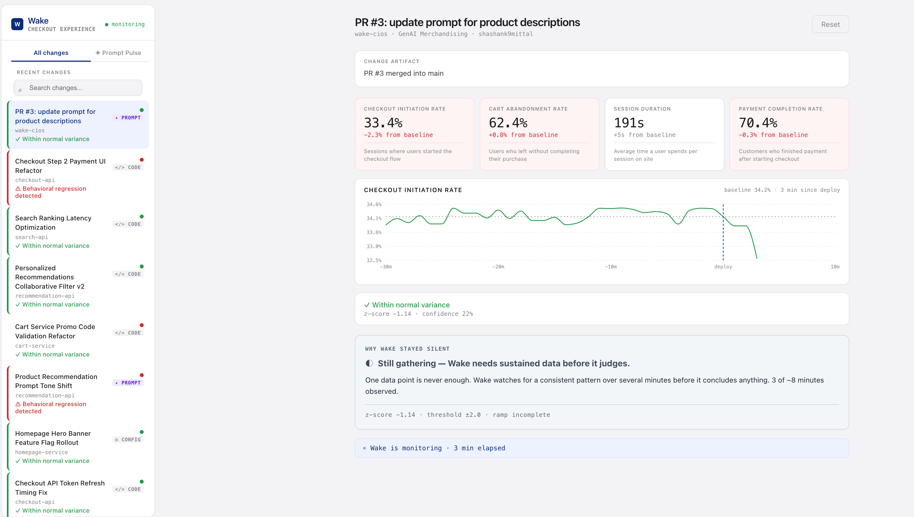
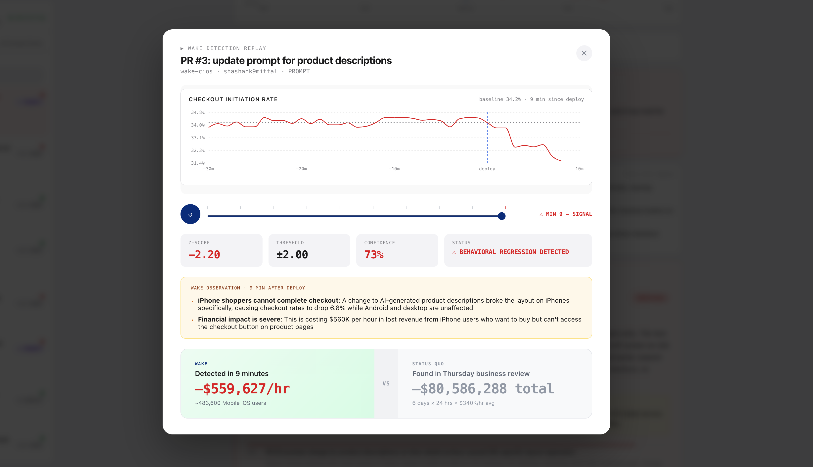
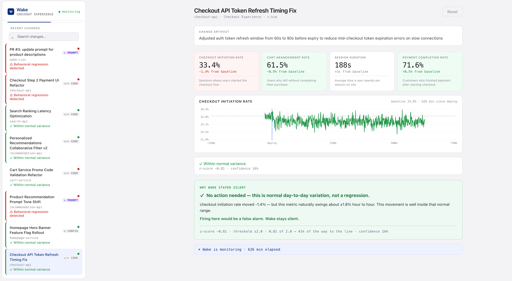

<div align="center">

# 🌊 Wake — Customer Impact Observability

### Walmart loses an estimated **$340,000 an hour** when a deploy quietly breaks customer behavior.<br/>Wake finds it in **~8 minutes — not 7 days.**


**Walmart Global Tech · CIOS Hackathon · June 2026 · Track 01: Customer Experience**

[🎬 Watch the demo](#-demo-3-minutes) · [⭐ Live GHE integration](#-live-github-enterprise-integration) · [📊 Business impact](#business-impact) · [🚀 Quickstart](#quickstart)

</div>

---

## TL;DR

A deploy can be **technically green and behaviorally broken** — 200s across the board, latency flat, and checkout conversion down 12%. Today, nobody finds that on a dashboard. They find it in a **weekly business review, up to 7 days later**. Wake closes that gap:

- **Watches every change, automatically.** Wake polls the **GitHub Enterprise API** every 10 seconds and turns every merged PR — code, config, **or AI prompt** — into a monitored change event. No instrumentation, no manual trigger.
- **Detects behavioral drift with statistics, not vibes.** A deterministic z-score engine compares live customer metrics (checkout initiation, cart abandonment, payment completion, session duration) against a rolling baseline. Signals fire on sustained deviation only — **a built-in decoy scenario proves Wake stays silent on noisy-but-healthy deploys.**
- **Explains it with an AI agent.** When a signal fires, a **Claude ReAct agent** investigates with 4 read-only tools and returns the responsible PR, a plain-English mechanism hypothesis, and **revenue impact in $/hour** — as a 3-bullet card written for a VP, not an SRE.
- **Shows the customer's side of the story.** A live storefront view flips the moment a prompt PR merges — judges watch _cause_ (the merge) and _effect_ (what the customer now sees, and the regression it triggers) on two screens at once.

> **Detection in ~8 minutes instead of a 7-day review cycle. No LLM in the detection path — Claude investigates only after the math has spoken.**



---

## 🎬 Demo

https://github.com/shashank9mittal/wake-cios/raw/main/docs/wake-demo.mp4

**What you'll see, end to end, with zero manual steps:**

1. A real PR editing an AI prompt is **merged on GitHub** — that's the only human action in the entire demo.
2. Within **≤10 seconds**, Wake's poller detects the merge, classifies it as a _prompt_ change from the file diff, and auto-starts monitoring.
3. The customer-facing storefront **visibly flips** from the concise V1 copy to the verbose V2 copy the prompt shipped — the literal thing a customer now sees.
4. Behavioral metrics begin to drift. At sustained statistical significance, **Wake signals the regression** (~8 monitored minutes after deploy).
5. One click on **Investigate**: the Claude agent correlates the signal to the merged PR, explains the likely mechanism, and prices the damage in **$/hour** — then **Detection Replay** re-runs the whole timeline from merge to alert.

---

## The Problem

When a deploy silently degrades customer behavior, the tools we have answer the wrong questions:

| Tool                    | Answers                                 | Doesn't answer                         |
| ----------------------- | --------------------------------------- | -------------------------------------- |
| APM / Splunk / Grafana  | "Is the service healthy?"               | "Are customers behaving differently?"  |
| A/B testing platforms   | "Which variant wins?" (planned changes) | "Did this _unplanned_ deploy hurt us?" |
| Weekly business reviews | "What happened last week?"              | Anything in real time                  |

And a new class of change makes the gap worse: **AI prompt updates**. As GenAI features ship into the shopping experience, a one-line prompt edit can change what millions of customers read — with **no code diff an APM would ever flag**. Today, prompt regressions are invisible to every tool in the table above.

That gap — technically green, behaviorally broken — is where the **$340K/hour** lives.

---

## The Solution

Wake closes the loop between _changes_ and _customer behavior_:

1. **Ingest change events** — poll the GitHub Enterprise API in real time; every merged PR becomes a first-class change event (code, config, or **AI prompt**, classified automatically from the file diff).
2. **Watch behavioral metrics** — checkout initiation, cart abandonment, session duration, payment completion — per service, continuously.
3. **Detect drift statistically** — deterministic z-score analysis against a rolling baseline, with severity gating so noise never pages anyone.
4. **Investigate with AI** — a ReAct agent (Claude) pins the responsible change, explains the likely mechanism, and estimates **revenue impact per hour**.
5. **Surface it for humans** — a 3-bullet, VP-ready observation card, not a wall of graphs.

---

## ⭐ Live GitHub Enterprise Integration

This is what makes Wake real, not a slideshow. Wake runs a background poller against the **GitHub Enterprise API** (`gecgithub01.walmart.com` in production; a live GitHub repo in the demo) every 10 seconds:

- A **merged PR is detected automatically** — no manual trigger — and surfaces as a `ghe-pr-{number}` change event at the **top of the sidebar**.
- Wake **classifies the change from the PR's file diff**: edits under `prompts/` → `prompt`, `*config.json` → `config`, everything else → `code` — and infers the affected surface the same way.
- A merged **prompt** PR **auto-triggers monitoring** and flips the customer-facing storefront at [`/demo`](#the-customers-screen-demo) — so a real PR merge ripples all the way into customer behavior, live.
- The integration is **idempotent and restart-safe**: on startup, Wake pre-seeds the most recent merged PR so an old merge never re-fires — and a restart is a clean slate (storefront back to V1, only scripted scenarios listed) until the next live merge.



**The pitch in one move:** merge a prompt PR → Wake detects it → the storefront copy visibly changes → behavioral metrics drift → Wake signals the regression and names the PR responsible. End to end, on real infrastructure. _(The repo's own history contains the merged PRs used to test this path.)_

---

## The Customer's Screen (`/demo`)

This is a **Customer Experience** entry, so Wake doesn't just show engineers a dashboard — it shows the customer's actual screen.

`http://localhost:5173/demo` is a simulated product-recommendation widget that polls Wake's `/demo-state` and re-renders the live recommendation copy:

- **V1 (concise):** _"Great value. Highly rated. Ships free."_
- **V2 (conversational):** the long, verbose paragraph the prompt change shipped.

When a prompt PR merges, this page flips from V1 to V2 in real time with a visible diff banner — while the main dashboard simultaneously detects the behavioral regression the new copy caused. **One screen shows the cause. The other shows the effect.**

---

## Business Impact

|                                                  | Today                             | With Wake                                                   |
| ------------------------------------------------ | --------------------------------- | ----------------------------------------------------------- |
| Time to detect a behavioral regression           | up to **7 days** (weekly review)  | **~8 minutes**                                              |
| Exposure per incident (at the $340K/hr estimate) | up to **~$57M**                   | **~$45K**                                                   |
| Who finds it                                     | an analyst, retroactively         | the on-call engineer, live                                  |
| AI prompt regressions                            | **invisible** to existing tooling | **first-class change events**                               |
| False alarms                                     | threshold alerts page on noise    | statistically gated — **the decoy scenario proves silence** |
| Onboarding a new service                         | new dashboards, new alerts        | **one config file, ~15 minutes**                            |



---

## How It Works

```
┌──────────────────────┐     ┌──────────────────────────────┐     ┌──────────────────────┐
│  GitHub Enterprise   │     │        Wake Backend          │     │    Wake Dashboard    │
│   (merged PRs)       │     │        (FastAPI)             │     │    (React + Vite)    │
│                      │     │                              │     │                      │
│ • code deploys       │poll │  • GHE poller (10s loop)     │     │ • Live drift charts  │
│ • config changes     │────▶│  • Change classifier         │────▶│ • Signal severity bar│
│ • AI prompt updates  │ 10s │  • Behavioral metric stream  │     │ • Observation card   │
└──────────────────────┘     │  • Z-score drift detection   │     │ • Revenue impact     │
                             │  • Severity gating           │     │ • Prompt Pulse tab   │
┌──────────────────────┐     │  • ReAct agent (Claude·4 tools)│   │ • Detection Replay   │
│  /demo storefront    │◀───▶│                              │     │ • Sidebar search     │
│  (customer's view)   │demo │                              │     │                      │
└──────────────────────┘state└──────────────────────────────┘     └──────────────────────┘
```

### Detection engine — statistics, not vibes

- **Deterministic z-score analysis** over per-metric rolling baselines — same input, same answer, every time. **No LLM anywhere in the detection path**; Claude is only invoked _after_ a signal fires, to explain it.
- **Ramped confidence window**: signals require sustained deviation (the flagship regression fires at minute 8), so a single noisy datapoint never alerts.
- **Direction-aware**: improvements never page anyone. A deploy that _raises_ checkout conversion is reported as positive drift, not an alert.
- **Severity gating**: `watch → warning → critical` buckets keyed on |z|; only deviations clearing the statistical threshold (|z| ≥ 2.0, sustained) reach a human.

### Investigation agent — explains, never acts

When a signal fires, a **ReAct loop powered by Claude (`claude-sonnet-4-5`)** investigates using **4 read-only tools** — change timeline, change artifact, segment breakdown, surface map, plus incident history — and returns structured JSON:

- The **responsible change event** (the merged PR) — _and why the others were ruled out._ The timeline tool deliberately includes **two innocent decoy changes**; the agent must pin the culprit by correlating deploy timing, affected surface, and user segment. It is never told the answer.
- A plain-English **mechanism hypothesis** (e.g., _"submit button pushed below the fold on small iOS viewports"_).
- **Estimated revenue impact per hour**, computed from `wake.config.json` values.
- A **3-bullet observation card** written for a VP, with affected-user count.

Every tool is read-only. **Wake observes and explains — it never auto-acts.** Resilience built in: exponential-backoff retry on API `529`s, layered JSON extraction, and a graceful fallback if the agent is unreachable.

---

## Demo Scenarios

Seven scripted scenarios exercise every path of the engine, plus the live GHE path above. Signal timings below are **measured against the actual engine**, not estimated:

| ID         | Scenario                                          | Type        | Outcome                         |
| ---------- | ------------------------------------------------- | ----------- | ------------------------------- |
| deploy-001 | Checkout Step 2 Payment UI Refactor               | Code deploy | 🔴 Signals min 10 · ~$500K/hr   |
| deploy-002 | Search Ranking Latency Optimization               | Code deploy | 🟢 Never signals                |
| deploy-003 | Personalized Recommendations Collaborative Filter | Code deploy | 🟢 Positive drift, no alert     |
| deploy-004 | Cart Service Promo Code Validation Refactor       | Code deploy | 🔴 Signals min 10               |
| deploy-005 | Product Recommendation Prompt Tone Shift          | **Prompt**  | 🔴 Signals min 8 · Prompt Pulse |
| deploy-006 | Homepage Hero Banner Feature Flag Rollout         | Config      | 🟢 Never signals                |
| deploy-007 | Checkout API Token Refresh Timing Fix — **decoy** | Code deploy | ⚪ **Never alerts** — the point |

**Scenario 007 is the heart of the pitch.** Its checkout metric dips below baseline — exactly what a naive threshold alert would page on. Wake stays silent because, statistically, the movement never approaches significance (|z| stays under 1 across a full hour). **No false alarms is a feature, not a gap** — and it's what makes engineers trust a signal when it _does_ fire.



---

## Wake vs. Existing Tools

|                                         | Wake   | Datadog         | LaunchDarkly               | Weekly Review     |
| --------------------------------------- | ------ | --------------- | -------------------------- | ----------------- |
| Detects behavioral regressions          | ✅     | ❌ (infra only) | ⚠️ (flagged changes only)  | ✅ (7 days later) |
| Correlates to the specific deploy       | ✅     | ❌              | ✅                         | ❌                |
| Revenue impact estimate                 | ✅     | ❌              | ❌                         | Sometimes         |
| AI prompt changes as first-class events | ✅     | ❌              | ❌                         | ❌                |
| Noise-immune (no false alarms)          | ✅     | ❌              | ❌                         | ✅                |
| Time to detection                       | ~8 min | N/A             | Minutes (known flags only) | ~7 days           |

---

## What's Real vs. Simulated

We'd rather you know exactly where the seams are:

- **Real:** the GitHub Enterprise polling integration and diff-based change classifier (tested against actual merged PRs — see this repo's history), the z-score detection engine and severity gating, live Claude API calls in a genuine ReAct tool-use loop, and the full React dashboard including Detection Replay.
- **Simulated:** customer behavioral metric streams — generated by a deterministic, hash-seeded simulator so every demo is exactly reproducible — and the investigation agent's _tool outputs_ (segment breakdowns, incident history), which are synthesized from the scenario. The agent's reasoning is real and unscripted; its evidence is staged, and deliberately includes decoys it must rule out.

The simulator stands in for behavioral event pipelines that already exist at Walmart. Swapping in a real stream (Kafka/Flink) changes the **data source, not the engine** — that's the design: **config-once, monitor always.**

---

## Quickstart

**Prerequisites:** Python 3.11+, Node 18+, an Anthropic API key. _(GitHub token optional — only needed for the live GHE poller.)_

```bash
# 1. Clone
git clone https://github.com/shashank9mittal/wake-cios && cd wake-cios

# 2. Backend
cd backend
echo "ANTHROPIC_API_KEY=sk-ant-..." > .env
echo "WAKE_TIME_MULTIPLIER=16"     >> .env   # 30-second demo signals (1 = real-time)
pip install -r ../requirements.txt
uvicorn main:app --port 8000 --reload

# 3. Frontend (new terminal)
cd frontend && npm install && npm run dev
# Dashboard at http://localhost:5173 · Storefront at http://localhost:5173/demo
```

**Run a scripted demo:**

```bash
curl -X POST localhost:8000/trigger/deploy-001   # signal fires in ~37s at 16×
# Click "Investigate" on the dashboard when the alert appears
```

**Reset:** `POST /reset/{scenario_id}` per scenario — or just restart the backend; a restart is a clean slate.

See **[STARTUP.md](./STARTUP.md)** for the full run guide, including the live GitHub Enterprise demo.

---

## Configuration

Point Wake at any service by editing one file — `backend/data/wake.config.json`:

```json
{
  "team": "Checkout Experience",
  "service": "checkout-api",
  "monitored_metrics": [
    "checkout_initiation_rate",
    "cart_abandonment_rate",
    "session_duration_s",
    "payment_completion_rate"
  ],
  "alert_sensitivity": "standard",
  "revenue_per_session": 47,
  "sessions_per_minute": 26000
}
```

`revenue_per_session` × `sessions_per_minute` drive the agent's revenue-impact math; `monitored_metrics` defines what the engine watches. **Config-once, monitor always — ~15-minute setup.**

| Variable               | Required | Purpose                                                          |
| ---------------------- | -------- | ---------------------------------------------------------------- |
| `ANTHROPIC_API_KEY`    | Yes      | Powers the ReAct investigation agent.                            |
| `WAKE_TIME_MULTIPLIER` | No       | Demo speed. `16` = ~30s signals; `1` = realistic ~8-min signals. |
| `GITHUB_TOKEN`         | No       | Auth for the live GHE poller (falls back to `GHE_TOKEN`).        |
| `GHE_BASE_URL`         | No       | GHE API base. Defaults to `https://api.github.com` for the demo. |

---

## API Reference

| Endpoint                 | Method | What it does                                               |
| ------------------------ | ------ | ---------------------------------------------------------- |
| `/health`                | GET    | Liveness check + count of scenarios loaded.                |
| `/config`                | GET    | Current `wake.config.json` values.                         |
| `/changes`               | GET    | All change events with live status & severity (GHE-first). |
| `/metrics/{change_id}`   | GET    | Live z-score statistics for a triggered scenario.          |
| `/latest-deploy`         | GET    | Force a GHE poll; report the most recent merged PR.        |
| `/demo-state`            | GET    | Current storefront prompt version (drives `/demo`).        |
| `/trigger/{scenario_id}` | POST   | Start monitoring a scenario.                               |
| `/investigate`           | POST   | Run the AI investigation on an active signal.              |
| `/reset/{scenario_id}`   | POST   | Reset a scenario to idle so it can be re-run.              |

Interactive Swagger docs at `http://localhost:8000/docs`.

---

## Tech Stack

- **Backend:** FastAPI · Python 3.11 · deterministic z-score engine · hash-seeded scenario simulator · async GHE poller (idempotent, restart-safe).
- **Agent:** Anthropic Claude (`claude-sonnet-4-5`) · ReAct tool-use loop · 4 read-only tools · exponential-backoff retry on `529` · structured-JSON output with layered extraction and graceful fallback.
- **Frontend:** React 19 · TypeScript · Vite · Recharts · Detection Replay timeline scrubber.
- **Change source:** GitHub Enterprise API — real merged PRs (`gecgithub01.walmart.com` in production).
- **Data:** in-memory from `scenarios.json` — no database, fully reproducible demos.

---

## Roadmap

- Plug into real behavioral event streams (Kafka/Flink replacing the simulator).
- Push updates over SSE/WebSocket, replacing dashboard polling.
- Auto-rollback trigger when revenue impact crosses a configurable threshold.
- Slack/Teams alert delivery with the observation card inline.
- Multi-service blast-radius analysis for shared-dependency deploys.
- Scheduled baseline recalibration to absorb organic metric drift.

---

<div align="center">

**Built by Shashank Mittal · Walmart Global Tech · CIOS Hackathon, June 2026**

_Walmart loses $340K an hour when a deploy quietly breaks customer behavior.<br/>Wake finds it in 8 minutes — not 7 days._

</div>
